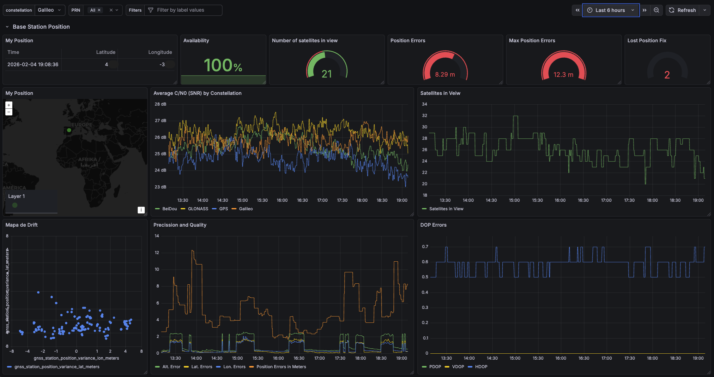
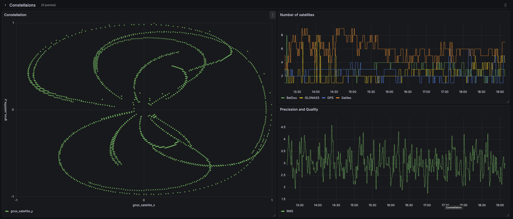

# GNSS UM980 Base Station Telemetry (NMEA → Prometheus)

This repository contains a small Python exporter that reads NMEA sentences from a Unicore UM980 (or compatible) GNSS receiver (typically via a TCP serial bridge) and exposes Prometheus metrics for position, fix quality, DOP, satellite view, and base-station stability.

The goal is to run a DIY RTK base station, learn GNSS/RTK along the way, and publish/visualize receiver telemetry with Prometheus + Grafana. (NTRIP caster publication is handled by UPrecise / ESP32 firmware / other tooling; this exporter focuses on observability.)

## Architecture

```text
UM980 receiver
   ├─ NMEA output (serial)
   ↓
ESP32 / serial-to-TCP bridge
   └─ TCP stream (NMEA)  -->  gnss-reader.py  -->  /metrics (Prometheus)
                                                                     -->  Prometheus  -->  Grafana
```

## Hardware

- Unicore UM980 GNSS receiver
- GNSS multi-band antenna with a good sky view
- ESP32

## Software

- Mini PC (Intel N100) running Proxmox
- Windows 11 VM (UPrecise is Windows-only)
- UPrecise
- Prometheus
- Grafana

## Step 1 — Configure UM980 (UPrecise on Windows)

References:

- https://www.ardusimple.com/how-to-configure-unicore-um980-um981-um982/
- https://youtu.be/hNGAsFLfFtI

### 1) Connect and verify

1. Connect antenna first.
2. Connect the receiver to the PC (USB).
3. Open UPrecise, select the COM port and `115200` (or AUTO), then connect.

### 2) Enable NMEA output on the port you will use

This exporter expects to receive NMEA sentences like:

- `GGA` (fix data)
- `RMC` (minimum navigation)
- `GSA` (DOP + active satellites)
- `GSV` (satellites in view)
- `GST` / `GNGST` (pseudorange error stats)

In UPrecise you can enable NMEA messages using the UI (recommended) or by typing commands in the command box.

Example (from the ArduSimple guide) enabling common NMEA messages at 1 Hz:

```text
MODE ROVER GNGGA 1 GNGSV 1 GNGSA 1 GPGST 1 GNRMC 1 SAVECONFIG
```

If you need to route messages to a specific serial interface (e.g., COM1/COM2) you can also set per-port outputs in the same style (exact port names and availability depend on your board/firmware).

### 3) Set the receiver as a base station

There are two common approaches:

- **Fixed coordinates** (best absolute accuracy): you already know the base coordinates.
- **Self-optimize / survey-in** (simpler): average position for N seconds, then lock the base.

Example “self-optimize” base station mode (from vendor/partner docs):

```text
MODE BASE TIME 120 2.5
SAVECONFIG
```

Interpretation:

- `TIME 120`: average for 120 seconds
- `2.5`: distance limit (meters) used by the receiver for the averaging filter

### 4) Enable full band / multiconstellation (and “unmask” constellations)

Two common knobs:

- **Signal group** (enables bands; e.g. including Galileo E6)
- **PVT algorithm** (multi-constellation)

Examples from the ArduSimple guide for UM980/UM981:

```text
CONFIG SIGNALGROUP 2
CONFIG PVTALG MULTI
SAVECONFIG
```

Constellation masking (command names vary by firmware, verify in your receiver’s command reference/manual):

```text
MASK BDS
MASK GAL
UNMASK BDS
UNMASK GAL
```

Rule of thumb:

- `MASK <CONST>` disables a constellation
- `UNMASK <CONST>` enables it back

Where `<CONST>` is typically one of `GPS`, `GLO`, `GAL`, `BDS`.

### 5) RTCM output (for NTRIP / RTK corrections)

This repo does not run an NTRIP caster. However, when running a base station you typically output RTCM messages on a serial port (often COM2) so another device can uplink them.

Example RTCM configuration commands shown in the ArduSimple guide:

```text
RTCM1006 COM2 10
RTCM1033 COM2 10
RTCM1074 COM2 1
RTCM1084 COM2 1
RTCM1094 COM2 1
RTCM1114 COM2 1
RTCM1124 COM2 1
SAVECONFIG
```

If you are using RTK2GO/other casters, configure your NTRIP client/server in the tool you’re using (UPrecise, ESP32 firmware, Linux service, etc.).

## Step 2 — Send receiver data to the network (ESP32)

References:

- https://simeononsecurity.com/guides/budget-diy-gps-gnss-base-station-setup-esp32-um980/
- https://www.youtube.com/watch?v=KGQ1xdwAq1A
- https://www.ardusimple.es/new-tripleband-rtk-receivers-unicore-um980-um981-um982/

Typical wiring (conceptually):

- Receiver `TX` → ESP32 `RX`
- Receiver `RX` → ESP32 `TX`
- `GND` → `GND`
- Power according to your module requirements (often 3.3V)

That guide uses ESP32-XBee firmware (web UI at `http://192.168.4.1/`) to bridge UART traffic over Wi-Fi.

What matters for this exporter:

- You must expose **a TCP stream** with NMEA sentences.
- Note the **IP** and **port** of that stream.

## Step 3 — Run the NMEA → Prometheus exporter

The exporter is implemented in [gnss-reader.py](gnss-reader.py). It opens a TCP connection to the GNSS stream, parses NMEA sentences, and exposes Prometheus metrics at `http://0.0.0.0:<PROMETHEUS_PORT>/metrics`.

### Option A: Run with Docker (recommended)

The Compose file maps container port `8000` to host port `8001`.

```bash
cd yuquiprox-gnss-receiver
docker compose up -d --build
curl http://localhost:8001/metrics
```

Configure runtime via environment variables in [docker-compose.yml](docker-compose.yml):

- `GNSS_HOST` (default: `192.168.68.68`)
- `GNSS_PORT` (default: `27`)
- `PROMETHEUS_PORT` (default: `8000`)

#### Proxmox notes (how to run it there)

If you’re running this on a Proxmox host, the usual pattern is:

`ESP32 (NMEA TCP stream) → Proxmox VM/LXC (containerized exporter) → Prometheus → Grafana`

**Where to run it**

- **LXC container with Podman:** run the exporter in a Proxmox LXC using Podman. If you used the Proxmox VE community script, see: https://community-scripts.github.io/ProxmoxVE/scripts?id=podman

   Inside the LXC, you can typically run the same Compose file with one of these (depending on what’s installed):

   - `podman compose up -d --build`
   - `podman-compose up -d --build`

### Option B: Run locally with Python

```bash
cd yuquiprox-gnss-receiver
./run.sh
```

Or:

```bash
cd yuquiprox-gnss-receiver
python3 -m venv venv
source venv/bin/activate
pip install -r requirements.txt

export GNSS_HOST="192.168.68.68"
export GNSS_PORT="27"
export PROMETHEUS_PORT="8000"

python gnss-reader.py
```

## Exported metrics

### Position

- `gnss_latitude_degrees`
- `gnss_longitude_degrees`
- `gnss_altitude_meters`

### Fix / quality

- `gnss_fix_quality` (0 invalid, 1 GPS fix, 2 DGPS fix, …)
- `gnss_hdop`
- `gnss_pdop`
- `gnss_vdop`
- `gnss_satellites_used`
- `gnss_satellites_visible{constellation}` (GPS/GLONASS/BeiDou/Galileo)

### Accuracy (from `GNGST`)

- `gnss_rms_std_dev_meters`
- `gnss_position_error_lat_meters`
- `gnss_position_error_lon_meters`
- `gnss_position_error_alt_meters`

### Velocity

- `gnss_speed_knots`
- `gnss_speed_kmh`
- `gnss_course_degrees`

### Base-station stability (computed)

The exporter sets a **reference position** automatically on the first valid fix and then tracks drift.

- `gnss_station_position_error_meters` (3D error magnitude vs reference)
- `gnss_station_position_variance_lat_meters`
- `gnss_station_position_variance_lon_meters`
- `gnss_station_position_variance_alt_meters`
- `gnss_station_fix_loss_count_total`
- `gnss_station_time_since_last_position_change_seconds`

### Per-satellite metrics

Labels:

- `satellite_id` is formatted like `G29` (GPS), `R82` (GLONASS), etc.
- `constellation` is one of `GPS`, `GLONASS`, `BeiDou`, `Galileo`

Metrics:

- `gnss_satellite_elevation_degrees{satellite_id,constellation}`
- `gnss_satellite_azimuth_degrees{satellite_id,constellation}`
- `gnss_satellite_snr_db{satellite_id,constellation}`
- `gnss_satellite_x{satellite_id,constellation}`
- `gnss_satellite_y{satellite_id,constellation}`

### Counters / health

- `gnss_messages_received_total{sentence_type}`
- `gnss_parse_errors_total{sentence_type}`
- `gnss_last_update_timestamp`
- `gnss_receiver_info{model="UM980",host="...",port="..."}`

## Step 4 — Scrape with Prometheus

Use [prometheus-config.yml](prometheus-config.yml) as a starting point.

Important: choose the right target based on how you run the exporter:

- If you run Docker Compose as provided, scrape `HOST_IP:8001`.
- If you run the Python process directly on the host with `PROMETHEUS_PORT=8000`, scrape `HOST_IP:8000`.

Example:

```yaml
scrape_configs:
   - job_name: "gnss-um980"
      scrape_interval: 15s
      scrape_timeout: 5s
      static_configs:
         - targets: ["192.168.68.68:8001"]
            labels:
               receiver: "um980"
```

## Step 5 — Visualize with Grafana

Add Prometheus as a datasource and build panels with PromQL.

### Dashboard

This repo now includes a ready-to-import dashboard JSON:

- [grafana/um980-dashboard.json](grafana/um980-dashboard.json)

### Screenshots (Grafana)

These screenshots are a real example of the dashboard powered by this exporter:

**1) Constellations and signal quality**

Shows satellite tracking/geometry (by constellation), the number of satellites in view, and a time series signal for quality/precision.



**2) Station position, drift and errors**

Includes the reported position, fix availability, satellites in view, drift/errors vs the reference position, and DOP (PDOP/HDOP/VDOP).



